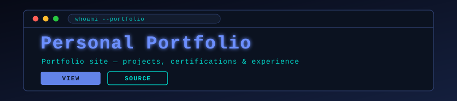

<p align="center">
  
</p>

<p align="center">
  
</p>

<p align="center">
  <a href="https://github.com/muqeetahmaad9/portfolio/stargazers"></a>
  <a href="https://github.com/muqeetahmaad9/portfolio/commits"></a>
  
  <a href="https://muqeetahmaad-portfolio.netlify.app/"></a>
</p>

---

### 📖 Overview

My personal portfolio: projects, certifications, education and work experience, built as a static site and deployed on Netlify.

### ✨ Features

- Project gallery with per-project imagery
- Certifications section (AWS ML, Azure AI and others)
- Education and experience timeline
- Responsive single-page layout, no build step

### 🧰 Built With

<p align="left">
  
</p>

### 🚀 Getting Started

```bash
# Any static server works
python -m http.server 8000
# then open http://localhost:8000
```

### 👤 Author

**Muqeet Ahmad** — AI/ML Engineer · IoT & Embedded Systems Builder

<p align="left">
  <a href="https://www.linkedin.com/in/muqeet--ahmad/"></a>
  <a href="https://muqeetahmaad-portfolio.netlify.app/"></a>
  <a href="mailto:muqeetahmad155@gmail.com"></a>
</p>

<p align="center">
  
</p>
